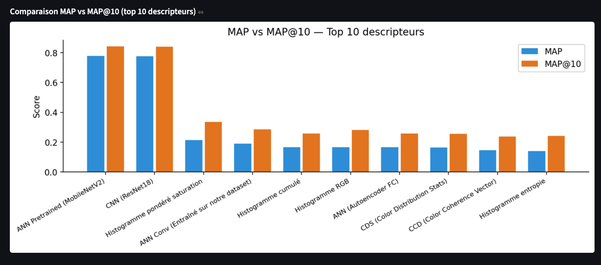
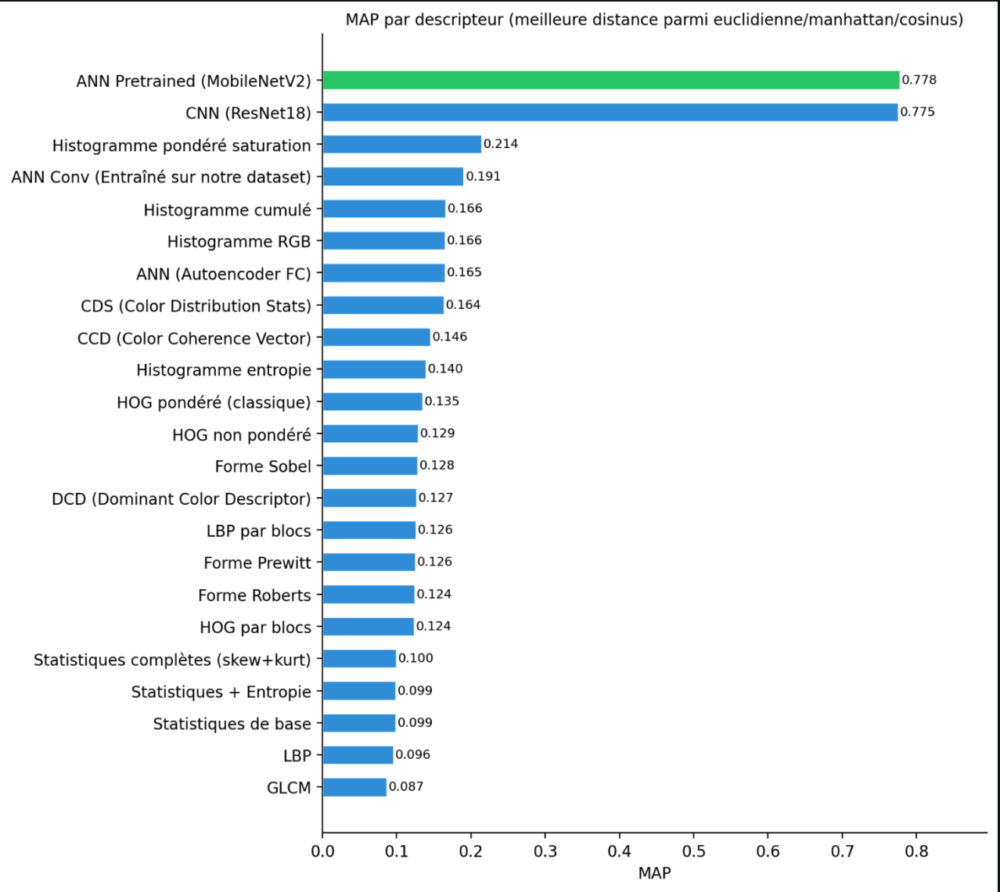
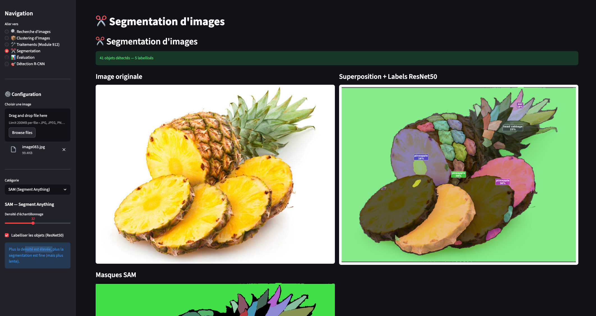
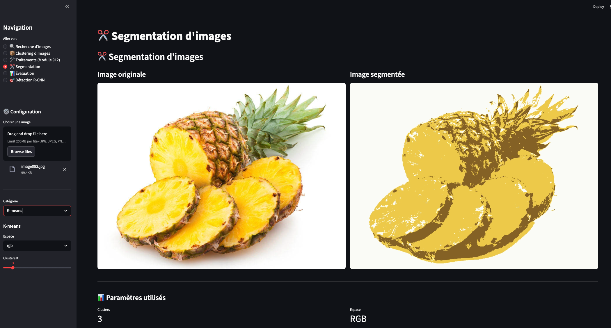
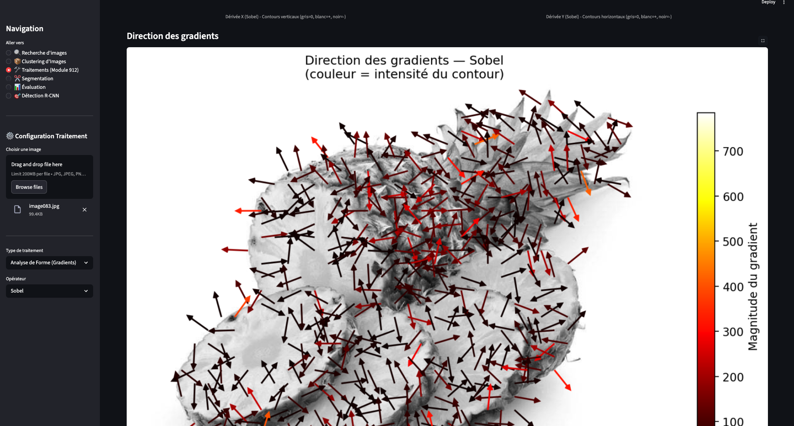
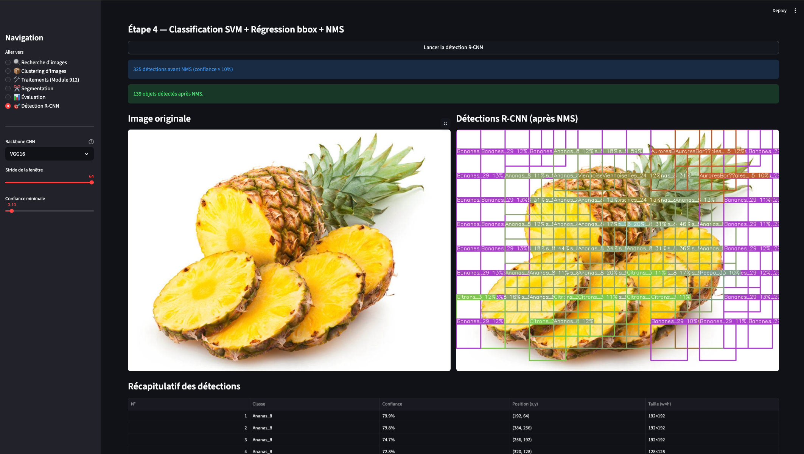

# VisionSearch — Application CBIR
### Yanis Yahia Ouahmed — M2 INFO IA — Traitement d'Images

Application complète de **recherche d'images par le contenu** (Content-Based Image Retrieval), développée avec Streamlit.

**Dataset** : 200 images, 40 classes, 5 images/classe.

---

## Résultats d'évaluation — MAP vs MAP@10



> MobileNetV2 et ResNet18 dominent avec **MAP ≈ 0.78** / **MAP@10 ≈ 0.84** — les descripteurs CNN/ANN pré-entraînés ImageNet surpassent largement les descripteurs classiques.



---

## Screenshots de l'application

### Segmentation — SAM (Segment Anything Model)


> 41 objets détectés et segmentés automatiquement, labels via ResNet50 (pineapple, ear, head cabbage...)

### Segmentation — K-Means


> K-Means k=3, espace RGB — les 3 couleurs dominantes extraites

### Analyse de gradient — Quiver plot Sobel


> Flèches colorées par magnitude (colormap hot) — direction du gradient Sobel

### Détection R-CNN


> Pipeline R-CNN complet : Sliding Window → VGG16/AlexNet → SVM → Régression bbox → NMS

---

## Lancement

```bash
pip install -r requirements.txt
streamlit run app1.py
```

> **SAM** : si `segment-anything` échoue via pip :
> ```bash
> pip install git+https://github.com/facebookresearch/segment-anything.git
> ```
> Télécharger le checkpoint ViT-B (~375 MB) depuis Meta et le placer à la racine :
> `sam_vit_b_01ec64.pth`

---

## Ce qui est implémenté

### 1. Descripteurs de couleur (7)

| Descripteur | Vecteur | Description |
|-------------|---------|-------------|
| **Histogramme RGB** | 96 dims | 3 canaux × 32 bins, normalisé |
| **Histogramme Pondéré Saturation** | 96 dims | Canal H pondéré par la saturation (HSV), pixels peu saturés masqués |
| **Histogramme Cumulé** | 96 dims | CDF du RGB — invariant aux changements de luminosité |
| **Histogramme + Entropie** | 97 dims | RGB hist + entropie de Shannon (–∑ p·log₂p) |
| **CDS** | 24 dims | Moyenne, std, skewness, kurtosis sur RGB + HSV |
| **DCD** | 20 dims | K-Means k=5 sur les pixels → 5 couleurs dominantes + proportions |
| **CCD** | 64 dims | Cohérence spatiale : pixels en grandes régions (coherent) vs isolés (incoherent) |

---

### 2. Descripteurs de texture (6)

| Descripteur | Vecteur | Description |
|-------------|---------|-------------|
| **GLCM** | 6 dims | Matrice de co-occurrence (4 angles) → énergie, entropie, contraste, IDM, dissimilarité, homogénéité |
| **LBP** | 26 dims | Patterns binaires locaux, cercle rayon=3, n=24 voisins, patterns uniformes |
| **LBP par blocs** | 416 dims | Grille 4×4 spatiale — LBP indépendant par bloc |
| **Statistiques de base** | 14 dims | 8 stats niveaux de gris + moyenne/std par canal RGB |
| **Statistiques complètes** | 22 dims | Idem + skewness + kurtosis par canal |
| **Statistiques + Entropie** | 15 dims | Stats de base + entropie de Shannon |

---

### 3. Descripteurs de forme / gradient (6)

| Descripteur | Dims | Particularité |
|-------------|------|---------------|
| **Sobel** | 64 | Noyau 3×3, détection horizontale/verticale |
| **Prewitt** | 64 | Moins de lissage que Sobel |
| **Roberts** | 64 | Noyaux croisés 2×2, 45°/135° |
| **HOG pondéré** | ~8100 | Vote proportionnel à la magnitude, blocs 16×16, L2 |
| **HOG non-pondéré** | ~8100 | Vote binaire, robuste aux variations d'intensité |
| **HOG par blocs** | 144 | Grille 4×4 × 9 bins directionnels |

Visualisation : **quiver plot** matplotlib (flèches colorées par magnitude).

---

### 4. Descripteurs CNN / ANN (4)

| Descripteur | Vecteur | Architecture | MAP |
|-------------|---------|--------------|-----|
| **MobileNetV2** | 1280 dims | Pré-entraîné ImageNet, backbone léger | **0.778** |
| **ResNet18** | 512 dims | Pré-entraîné ImageNet, AdaptiveAvgPool | **0.778** |
| **ConvAutoencoder** | 128 dims | Conv (3→16→32→64) → 128 → ConvTranspose, 50 epochs | 0.165 |
| **Autoencoder FC** | 128 dims | 12288→512→256→128→…, 30 epochs, non supervisé | 0.165 |

> Les autoencoders sont entraînés en mode **non supervisé** (5 images/classe insuffisant pour fine-tuning).

---

### 5. Métriques de distance (3)

| Distance | Formule | Meilleure pour |
|----------|---------|----------------|
| **Euclidienne** | √(∑(v₁−v₂)²) | Descripteurs classiques |
| **Manhattan** | ∑\|v₁−v₂\| | Histogrammes |
| **Cosinus** | 1 − (v₁·v₂)/(‖v₁‖·‖v₂‖) | CNN/ANN (haute dimension) |

---

### 6. Segmentation (15+ méthodes)

#### Seuillage global (5)
Manuel, Otsu, Médiane, Moyenne (min+max)/2, P-tile

#### Seuillage local adaptatif (6)
Moyenne locale, Médiane locale, Min-Max local, Niblack, Sauvola, Wolf

#### K-Means
K couleurs dominantes (RGB ou HSV), K-Means++, 100 itérations

#### Deep Learning (4)

| Modèle | Architecture | Particularité |
|--------|-------------|---------------|
| **DeepLabV3** | ResNet101 + Atrous convolution | Pré-entraîné PASCAL VOC, 21 classes |
| **SegNet** | Encoder VGG16-like + MaxUnpool | Frontières nettes grâce aux indices de pooling |
| **UNet** | Encoder-Decoder + skip connections | Concatène features sémantiques + spatiales |
| **PSPNet** | Backbone + Pyramid Pooling Module | 4 échelles (1×1, 2×2, 3×3, 6×6) |

#### SAM — Segment Anything Model (Meta AI) ⭐ *fonctionnalité non demandée*
- Vision Transformer ViT-B, segmentation universelle sans classes fixes
- `SamAutomaticMaskGenerator` : grille 32×32 pts, iou_thresh=0.88, stability=0.95
- Labeling optionnel par **ResNet50** (1000 classes ImageNet)

---

### 7. Détection — Pipeline R-CNN complet

```
Image → Sliding Window → CNN Backbone → SVM → Régression bbox → NMS → Détections
```

| Étape | Détail |
|-------|--------|
| **Propositions** | Fenêtre glissante, 4 tailles (64→192 px), stride configurable, max 2000 régions |
| **Backbone VGG16** | Features 512 dims via AdaptiveAvgPool |
| **Backbone AlexNet** | Features 256 dims via AdaptiveAvgPool — plus rapide |
| **SVM** | StandardScaler → LinearSVC(C=0.1) → CalibratedClassifierCV |
| **Entraînement SVM** | Image complète + 3 crops aléatoires → ~800 échantillons |
| **Régression bbox** | Ridge(α=1.0), prédit (dx, dy, dw, dh) |
| **NMS** | Suppression si IoU > 0.3 |

---

### 8. Évaluation — 69 combinaisons

- **AP** : précision moyenne aux rangs pertinents
- **MAP** / **MAP@10** : sur toutes les 200 images requêtes
- **69 combinaisons** : 23 descripteurs × 3 distances
- Résultats dans `resultats_evaluation.csv`

---

### 9. Pages de l'application (6)

| Page | Contenu |
|------|---------|
| **Recherche** | Upload image → top-k résultats, visualisation du vecteur descripteur |
| **Clustering** | K-Means sur tous les descripteurs → groupes visuels |
| **Traitements** | Espaces couleur, quiver plot gradient, convolution/corrélation, restauration |
| **Segmentation** | 15+ méthodes dont SAM et 4 modèles DL |
| **Évaluation** | MAP/MAP@10 interactif pour 69 combinaisons |
| **Détection R-CNN** | Pipeline complet VGG16 / AlexNet |

---

## Structure du projet

```
├── app1.py                        # Application principale (~3700 lignes)
├── evaluate_all.py                # Script d'évaluation autonome
├── requirements.txt
├── BD_images_prepared/            # Dataset (40 classes, 200 images)
├── conv_autoencoder_dataset.pth   # ConvAutoencoder entraîné (50 epochs)
├── rcnn_svm_alexnet.pkl           # SVM R-CNN AlexNet
├── rcnn_reg_alexnet.pkl           # Régresseur bbox AlexNet
├── resultats_evaluation.csv       # MAP / MAP@10 — 69 combinaisons
└── screenshots/                   # Captures d'écran de l'application
```

> `sam_vit_b_01ec64.pth` (375 MB) non inclus — à télécharger depuis Meta.
